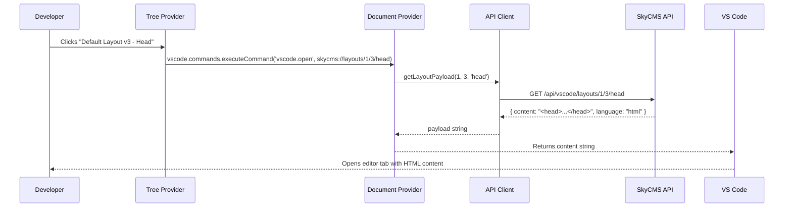
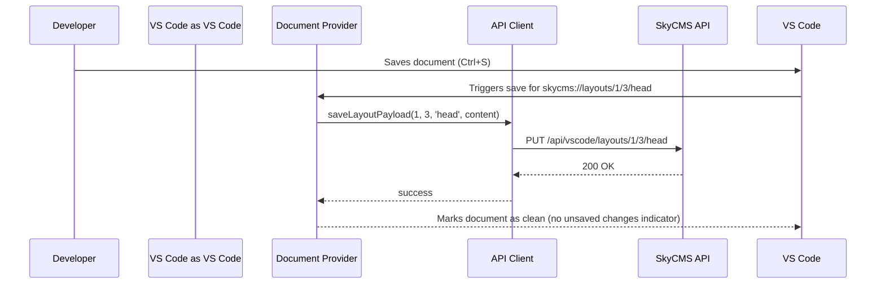

# Architecture

[← Back to Index](00-Index.md)

This document describes how the SkyCMS VS Code Explorer is structured and how its parts fit together.

---

## System Overview

The extension sits between the developer's VS Code instance and the SkyCMS Editor server. It does not talk to the database. All data flows through the SkyCMS API.

```mermaid
flowchart TD
    subgraph VS Code
        A[TreeView\nSkyCMS Explorer panel]
        B[Virtual Document Provider\nskycms:// URIs]
        C[Auth Manager\nCredentials & token storage]
        D[API Client\nHTTP + Bearer token]
        A --> D
        B --> D
        C --> D
    end

    D -->|HTTPS + Bearer token| E

    subgraph SkyCMS Editor Server
        E[/api/vscode/* endpoints]
        F[SkyCMS Role System\nEditor / Administrator]
        E --> F
    end

    E -->|Authenticated queries| G[(SkyCMS Database)]
```

The developer signs in once. The extension stores a bearer token and attaches it to every subsequent request. If the token expires or the user's role is revoked, the API returns a 401 and the extension prompts for sign-in again.

---

## Extension Components

### Auth Manager

Handles sign-in, token storage, and sign-out.

- Starts a browser-based sign-in flow via SkyCMS auth bootstrap endpoint
- Polls for sign-in completion and exchanges a one-time code for a bearer token
- Stores the bearer token in VS Code's [SecretStorage](https://code.visualstudio.com/api/references/vscode-api#SecretStorage) - the secure credential store that VS Code provides to extensions
- Exposes a `getToken()` method that the API Client calls before every request
- Clears the token and refreshes the tree on sign-out or on 401

### API Client

The single point of contact between the extension and the SkyCMS server.

- Takes a base URL from the active site profile (managed by Site Manager)
- Attaches `Authorization: Bearer <token>` to every request
- Handles HTTP errors consistently: 401 -> re-authenticate, 403 -> show access denied, 5xx -> show error notification
- Returns typed response objects that the Tree Provider and Document Provider consume
- Does not contain any tree logic or document logic

### Tree Provider (`SkyCmsTreeProvider`)

Implements VS Code's `TreeDataProvider<SkyCmsNode>` interface.

- Calls the API Client to load layouts, templates, articles/blog streams, and files
- Maps each entity to a `SkyCmsNode` (a `vscode.TreeItem` subclass)
- Handles node expansion lazily: versions and folder children are loaded only when expanded
- Fires `onDidChangeTreeData` to refresh the tree when data changes
- Attaches a `command` to each leaf node so that clicking it opens the correct virtual document
- Applies optional content filtering for layouts, templates, articles, or files

### Virtual Document Provider (`SkyCmsDocumentProvider`)

Implements VS Code's `TextDocumentContentProvider` interface.

- Registered for the `skycms://` URI scheme
- Receives a `skycms://` URI and calls the API Client to fetch the payload for that entity field
- Returns the content as a string (HTML, Razor, Markdown, JSON - depending on the URI)
- On save, calls the API Client to write the updated content back to SkyCMS

---

## Data Flow: Opening a Document

This sequence shows what happens when a developer clicks a Layout version node in the tree.



---

## Data Flow: Saving a Document



---

## VS Code Extension Manifest

The extension registers in the VS Code Explorer panel (the same sidebar where the native file tree lives). It appears as a separate collapsible section labeled **SkyCMS**.

The current manifest includes command families for:

- Site and auth flows
- Discovery flows (search, filter, recent/pinned)
- Preview and lifecycle operations (publish/unpublish/restore/diff/duplicate)
- File workflows (open, upload, new file/folder, move/rename, clipboard, download, path copy)

```json
"contributes": {
  "views": {
    "explorer": [
      { "id": "skycmsExplorer", "name": "SkyCMS" }
    ]
  },
  "commands": [
    { "command": "skycms.signIn", "title": "Sign In" },
    { "command": "skycms.searchContent", "title": "Search Content" },
    { "command": "skycms.previewCurrent", "title": "Preview Current Context" },
    { "command": "skycms.restoreArticle", "title": "Restore Deleted Article..." },
    { "command": "skycms.diffArticleVersion", "title": "Compare with Current Draft" },
    { "command": "skycms.diffLayoutVersion", "title": "Compare With Editable" },
    { "command": "skycms.openFileManager", "title": "Open in File Manager" },
    { "command": "skycms.copyCmsPath", "title": "Copy CMS Path" }
  ],
  "configuration": {
    "title": "SkyCMS Explorer",
    "properties": {
      "skycms.editorUrl": {
        "type": "string",
        "description": "Base URL of the SkyCMS Editor (e.g. https://editor.mysite.com)"
      }
    }
  }
}
```

---

## Technology Stack

| Concern | Technology |
| --- | --- |
| Extension language | TypeScript |
| VS Code API | `vscode` (npm package, types only) |
| HTTP client | Node `https` module or `node-fetch` (no large dependencies) |
| Token storage | `vscode.ExtensionContext.secrets` (SecretStorage) |
| Build | esbuild or webpack (standard VS Code extension bundler) |
| Server-side API | ASP.NET Core controller in the SkyCMS Editor project |

The server-side API is part of the SkyCMS Editor codebase, not this repository. See [Data Access](06-Data-Access.md) for the endpoint contract.

---

[← Back to Index](00-Index.md)
