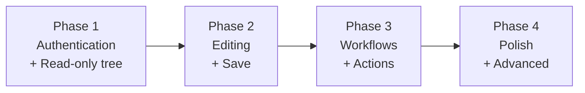

# Phased Execution

[← Back to Index](00-Index.md)

This document breaks the project into four phases. Each phase produces working, useful software on its own. You can stop after any phase and still have something that improves SkyCMS developer productivity.

> Status note (May 2026): This page is a historical roadmap. Current shipped behavior now includes content search, explorer filtering, recent/pinned quick access, preview-current, validation and safety feedback, and lifecycle work such as restore, duplicate, and version comparison flows. For live implementation status, use [12-Gap-Closure-Plan](12-Gap-Closure-Plan.md).

---

## Phase 1 — Read-Only Explorer with Authentication

**Goal:** A developer can sign in to SkyCMS from VS Code and browse all Layouts, Page Templates, and Articles in the sidebar tree.

**What is built in Phase 1:**

### Extension side
- [ ] `AuthManager` — external browser sign-in flow, token storage in SecretStorage, `GET /api/vscode/auth/me` on activation
- [ ] `ApiClient` — base HTTP client with bearer token header and error handling
- [ ] `SkyCmsTreeProvider` — top-level categories (Layouts, Templates, Articles), lazy child loading via API
- [ ] Layout nodes (display `LayoutName`) with child field nodes generated locally
- [ ] Page Template nodes (display `Title`) with child field nodes generated locally
- [ ] Article nodes grouped under Drafts and Published with `ArticleType` badge
- [ ] Unauthenticated state (single "Sign in to SkyCMS…" node)
- [ ] **SkyCMS: Sign In** command
- [ ] **SkyCMS: Sign Out** command
- [ ] **SkyCMS: Refresh** command
- [ ] `skycms.editorUrl` setting

### SkyCMS Editor API side
- [ ] `GET /api/vscode/auth/browser/start`
- [ ] `POST /api/vscode/auth/browser/exchange`
- [ ] `POST /api/vscode/auth/logout`
- [ ] `GET /api/vscode/auth/me`
- [ ] `GET /api/vscode/layouts`
- [ ] `GET /api/vscode/templates`
- [ ] `GET /api/vscode/articles`

**Deliverable:** A developer opens VS Code, signs in, and sees the full SkyCMS entity tree. No editing yet.

**Effort estimate:** Small — the extension side is mostly wiring, not logic. The API side is a new ASP.NET Core controller with lightweight query methods.

---

## Phase 2 — Editing and Saving

**Goal:** A developer can click any payload node in the tree, open its content in the VS Code editor, edit it, and save it back to SkyCMS.

**What is built in Phase 2:**

### Extension side
- [ ] `SkyCmsDocumentProvider` — implements `TextDocumentContentProvider` for `skycms://`
- [ ] Register provider for `skycms://` scheme
- [ ] Document field nodes for Layout (`Notes`, `Head`, `Header`, `Footer`)
- [ ] Document field nodes for Templates (`Content`, `Description`)
- [ ] Document field nodes for Articles (`Introduction`, `Content`, `Header JS`, `Footer JS`)
- [ ] InputBox field nodes for short values (`Layout Name`, `Template Title`, `Published`, `Title`, `Banner Image`, `Category`)
- [ ] `onWillSaveTextDocument` handler — intercepts `Ctrl+S` for `skycms://` documents and calls PUT endpoint
- [ ] Friendly tab titles (e.g., "Default Site Layout – Header")
- [ ] Language mode assignment by field key (`html` or `plaintext`)

### SkyCMS Editor API side
- [ ] `GET/PUT /api/vscode/layouts/{layoutNumber}/layoutName`
- [ ] `GET/PUT /api/vscode/layouts/{layoutNumber}/notes`
- [ ] `GET/PUT /api/vscode/layouts/{layoutNumber}/head`
- [ ] `GET/PUT /api/vscode/layouts/{layoutNumber}/header`
- [ ] `GET/PUT /api/vscode/layouts/{layoutNumber}/footer`
- [ ] `GET/PUT /api/vscode/templates/{templateGuid}/title`
- [ ] `GET/PUT /api/vscode/templates/{templateGuid}/content`
- [ ] `GET/PUT /api/vscode/templates/{templateGuid}/description`
- [ ] `GET/PUT /api/vscode/articles/{articleNumber}/published`
- [ ] `GET/PUT /api/vscode/articles/{articleNumber}/title`
- [ ] `GET/PUT /api/vscode/articles/{articleNumber}/bannerImage`
- [ ] `GET/PUT /api/vscode/articles/{articleNumber}/category`
- [ ] `GET/PUT /api/vscode/articles/{articleNumber}/introduction`
- [ ] `GET/PUT /api/vscode/articles/{articleNumber}/content`
- [ ] `GET/PUT /api/vscode/articles/{articleNumber}/headerJavaScript`
- [ ] `GET/PUT /api/vscode/articles/{articleNumber}/footerJavaScript`

**Deliverable:** A developer can click any document field node, edit content in VS Code, save with `Ctrl+S`, and update short-value fields through InputBox dialogs.

**Effort estimate:** Medium — the document provider and save handler are the most novel pieces. The API endpoints are straightforward read/write operations.

---

## Phase 3 — Workflows and Actions

**Goal:** The extension moves beyond browse/edit to support common SkyCMS operations directly from VS Code.

**What is built in Phase 3:**

### Workflow commands (right-click context menu on tree nodes)
- [ ] **Publish Layout Version** — sets a layout version as Published
- [ ] **Set as Default** — marks a layout version as the default for its family
- [ ] **Publish Article** — moves a draft article to Published state
- [ ] **Unpublish Article** — moves a published article back to Draft
- [ ] **New Article** — prompts for title and ArticleType, creates the article via API, refreshes the tree
- [ ] **Duplicate Layout Version** — creates a new version from an existing one (useful for safe edits)

### Extension side
- [ ] Context menu contributions in `package.json` (`"when": "viewItem == skycms.layoutVersion"` etc.)
- [ ] Command handlers for each workflow action
- [ ] Confirmation dialogs for destructive or irreversible actions (Publish, Unpublish)

### SkyCMS Editor API side
- [ ] `POST /api/vscode/layouts/{layoutNumber}/{version}/publish`
- [ ] `POST /api/vscode/layouts/{layoutNumber}/{version}/set-default`
- [ ] `POST /api/vscode/articles/{articleId}/publish`
- [ ] `POST /api/vscode/articles/{articleId}/unpublish`
- [ ] `POST /api/vscode/articles` (create new article)
- [ ] `POST /api/vscode/layouts/{layoutNumber}/versions` (duplicate a version)

**Deliverable:** The extension covers the full SkyCMS content authoring lifecycle without opening a browser.

**Effort estimate:** Medium-large — the number of commands grows, but each one is a small, independent unit of work.

---

## Phase 4 — Polish and Advanced Features

**Goal:** The extension is production-quality and ready to be shared with the wider SkyCMS developer community.

**Candidates for Phase 4 (not all must be done):**

| Feature | Description |
|---|---|
| **Version diff** | Open two layout versions side by side using VS Code's diff editor |
| **FileSystemProvider** | Upgrade `skycms://` to a full filesystem provider, enabling rename, drag-and-drop, and git-style diff |
| **Multi-site support** | Allow the developer to configure and switch between multiple SkyCMS Editor instances |
| **Read-only enforcement** | Mark Published layout versions as read-only in the editor; require the developer to duplicate before editing |
| **Validation on save** | Run basic HTML validation before sending to the API; show inline diagnostics |
| **Preview** | Open a browser tab with the live-rendered page after saving a template or article |
| **Publishing pipeline integration** | Trigger a SkyCMS publish pipeline from VS Code |
| **Extension marketplace** | Package and publish the extension to the VS Code Marketplace |

**Deliverable:** A polished, shareable extension that other SkyCMS developers and teams can install.

---

## Dependency Map

Phase 2 cannot start until Phase 1 is complete. Phase 3 requires Phase 2. Phase 4 features are independent of each other and can be done in any order.

---

[← Back to Index](00-Index.md)

